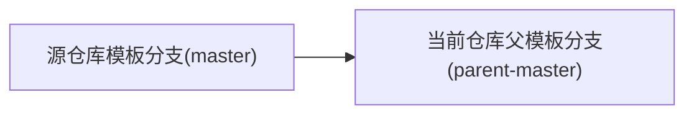

# Template Sync

模板同步

## github-repo-sync

[GitHub Repo Sync](https://github.com/marketplace/actions/github-repo-sync): A GitHub Action for syncing the current repository using force push.

```yml
# File: .github/workflows/repo-sync.yml

name: Repository Sync

on:
  schedule:
    - cron: "*/15 * * * *"
  workflow_dispatch:

jobs:
  repo-sync:
    runs-on: ubuntu-latest
    steps:
      - uses: actions/checkout@v2
        with:
          persist-credentials: false
      - name: repo-sync
        uses: repo-sync/github-sync@v2
        with:
          source_repo: "langnang-temp/root" # 源仓库
          source_branch: "master" # 源仓库分支
          destination_branch: "parent-master" # 当前仓库分支
          github_token: ${{ secrets.ACCESS_TOKEN }}
```


